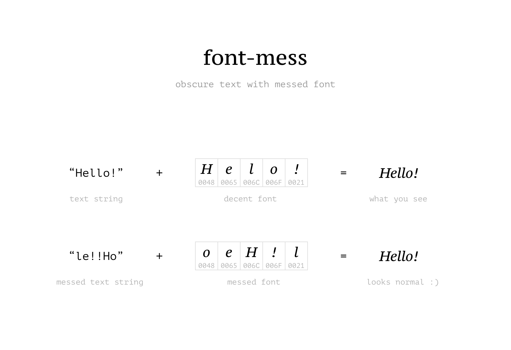

Inspect this [obscured quote][o-quote] from Jules Winnfield
to see how it works.

## Install

```
npm install font-mess
```

## Usage

### Programmatic

```javascript
const fs = require('fs')
const mess = require('font-mess')

const messer = mess(fs.readFileSync('some-font.ttf'))
const messed = messer('some text')
// => {
//    originalText,
//    messMapping,
//    messedText,
//    messedFontBuffer
// }
```

### Endpoint

- https://mess.now.sh

## License

MIT @ [Amio](author)

[npm-badge]:  https://img.shields.io/npm/v/font-mess.svg?style=flat-square
[npm-link]:   https://www.npmjs.com/package/font-mess
[author]:     https://github.com/amio
[o-quote]:     https://mess.now.sh/html/Ezekiel%2025:17.%20The%20path%20of%20the%20righteous%20man%20is%20beset%20on%20all%20sides%20by%20the%20inequities%20of%20the%20selfish%20and%20the%20tyranny%20of%20evil%20men.%20Blessed%20is%20he%20who,%20in%20the%20name%20of%20charity%20and%20good%20will,%20shepherds%20the%20weak%20through%20the%20valley%20of%20the%20darkness,%20for%20he%20is%20truly%20his%20brother%E2%80%99s%20keeper%20and%20the%20finder%20of%20lost%20children.
